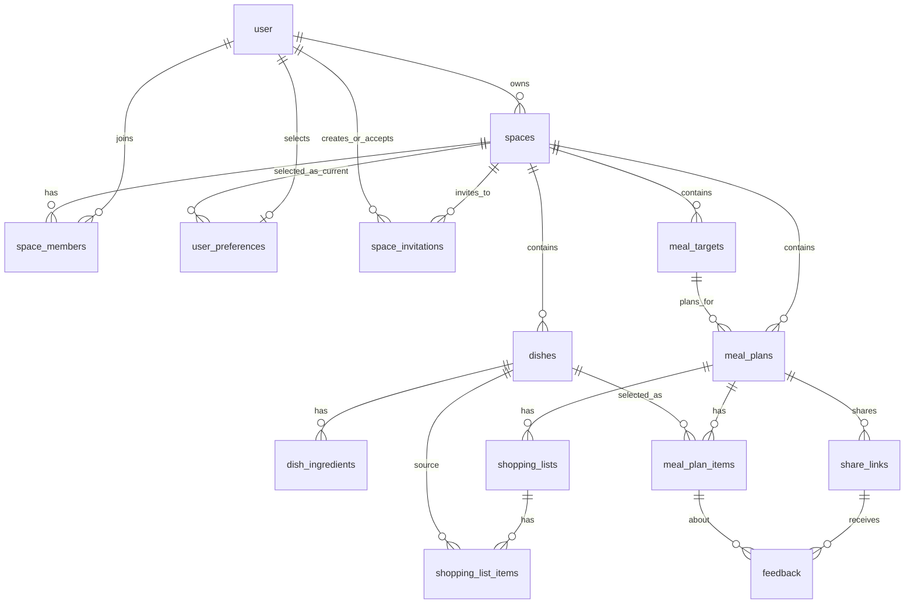

# Data Model

饭单的数据模型围绕一个核心边界展开：用户通过 `space_members` 加入一个或多个 `spaces`，所有创建者侧业务数据必须通过当前 `space_id` 隔离。LES-104 保留 `spaces.owner_user_id` 兼容 1.0，LES-105 再把运行时授权切换到成员关系。

## Tables

### `user`

Better Auth 生成的用户表。应用侧不直接维护登录凭据，只通过 Better Auth 读写认证相关数据。

### `spaces`

家庭或服务团队共享的数据空间。首次登录后默认创建一个空间。

- `owner_user_id`: Better Auth user id。
- 1.1 同时为 owner 建立 `space_members` 记录。
- 所有创建者侧业务表通过 `space_id` 归属到空间。

### `space_members`

登录用户与工作区的长期成员关系。

- 同一用户在同一空间只能有一条记录。
- 角色：`owner`、`member`。
- 状态：`active`、`left`、`removed`。
- 每个空间最多保留一个 owner 角色。

### `space_invitations`

邀请家庭成员加入工作区的持久化记录。

- `token` 全局唯一。
- 状态：`pending`、`accepted`、`revoked`；过期通过 `expires_at` 动态判断。
- 保存邀请人、接受人、接受时间和撤销时间。
- LES-100 负责邀请创建、接受和幂等规则。

### `user_preferences`

保存用户当前选择的 `current_space_id`，避免修改 Better Auth 自动生成的用户和会话表。

- 删除当前空间时自动将选择清空。
- LES-105 使用该值前必须验证用户仍是对应空间的 active 成员。

### `meal_targets`

用餐对象，可以是家庭、客户、聚餐或其他场景。

- 属于 `spaces`。
- 被 `meal_plans.target_id` 引用。
- 保存人数、口味、忌口、预算和联系备注。

### `dishes`

菜品库。

- 属于 `spaces`。
- `base_servings` 定义整份食材清单对应的人数；购物数量按饭单份数与它的比例换算。
- `serving_basis_confirmed` 区分用户确认的基准与迁移旧菜品的安全默认。
- 可被饭单项和购物清单项引用。
- `tags` 使用 JSON 文本保存简单标签数组。

### `dish_ingredients`

菜品食材。

- 属于 `dishes`。
- 用于后续生成购物清单。
- 第一版不做复杂单位换算，只保存名称、数量、单位、分类和备注。

### `meal_plans`

饭单核心表。

- 属于 `spaces`。
- 可关联一个 `meal_targets`。
- 支持 `single_meal`、`day`、`week`、`gathering`。
- 状态为 `draft`、`pending_confirmation`、`confirmed`、`completed`、`archived`。

### `meal_plan_items`

饭单里的菜品项。

- 属于 `meal_plans`。
- 可关联一个 `dishes`。
- 保存餐别、日期、份数、推荐星级、排序和备注。
- `recommendation_rating` 是当前饭单条目的可选 1-5 星推荐标注；同一道菜在不同饭单里可以有不同星级，公开分享页可见。

### `shopping_lists`

购物清单。

- 属于 `meal_plans`。
- 第一版允许一个饭单有多个购物清单，但默认使用一个 active 清单。

### `shopping_list_items`

购物清单项。

- 属于 `shopping_lists`。
- 可选关联来源菜品 `source_dish_id`。
- 保存勾选状态，便于移动端买菜使用。

### `share_links`

饭单分享链接。

- 属于 `meal_plans`。
- `token` 全局唯一。
- 控制访客是否可查看、反馈、确认。

### `feedback`

访客反馈。

- 属于 `share_links`。
- 可选关联具体 `meal_plan_items`。
- 支持喜欢、不喜欢、想替换、备注和确认。

## Space Isolation

API 查询创建者侧数据时必须从当前用户的 `space_id` 出发：

- 当前空间必须来自已验证的 active 成员关系，不能只相信查询参数或 cookie 中的空间 ID。
- 列表查询必须过滤 `space_id`。
- 详情查询应校验目标记录是否属于当前 `space_id`。
- 子表查询需要通过父表回到 `space_id`，例如 `meal_plan_items -> meal_plans.space_id`。
- 分享页是例外：访客通过 `share_links.token` 读取受限数据，不要求登录。

## Relationship Summary

## Index Strategy

Current indexes prioritize MVP queries:

- `spaces.owner_user_id`: find current user's workspace.
- `space_members(space_id, user_id)`: unique membership and member lookup.
- `space_members(user_id, status)`: active workspaces for a user.
- partial `space_members(space_id)` where role is owner: one owner role per workspace.
- `space_invitations.token`: unique invitation lookup.
- `space_invitations(space_id, status)`: workspace invitation management.
- `user_preferences.current_space_id`: current workspace preference lookup and foreign-key maintenance.
- `meal_targets.space_id`, `meal_targets(space_id, type)`: target list and filters.
- `dishes.space_id`, `dishes(space_id, name)`, `dishes(space_id, category)`: dish list, search and category filter.
- `meal_plans.space_id`, `meal_plans(space_id, status)`, `meal_plans(space_id, start_date)`: meal plan list, dashboard and status filter.
- `meal_plan_items(meal_plan_id, sort_order)`, `meal_plan_items(meal_plan_id, planned_date)`: detail page grouping and ordering.
- `shopping_list_items(shopping_list_id, checked)`: buy-list display and checked filter.
- `share_links.token`: public share lookup.
- `feedback(share_link_id, reaction)`: feedback aggregation.
