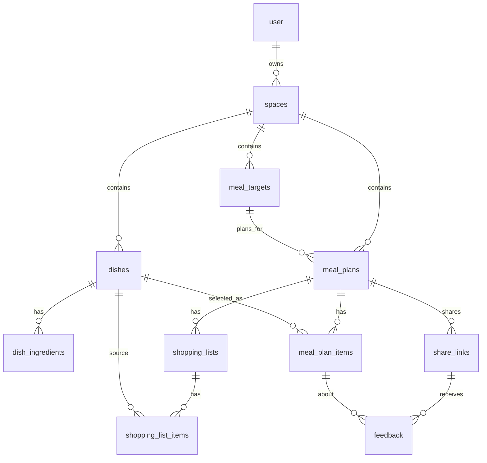

# Data Model

饭单 MVP 的数据模型围绕一个核心边界展开：创建者登录后拥有一个或多个 `spaces`，所有创建者侧业务数据必须通过 `space_id` 隔离。

## Tables

### `user`

Better Auth 生成的用户表。应用侧不直接维护登录凭据，只通过 Better Auth 读写认证相关数据。

### `spaces`

创建者的数据空间。第一版登录后默认创建一个空间。

- `owner_user_id`: Better Auth user id。
- 后续所有创建者侧业务表通过 `space_id` 归属到空间。

### `meal_targets`

用餐对象，可以是家庭、客户、聚餐或其他场景。

- 属于 `spaces`。
- 被 `meal_plans.target_id` 引用。
- 保存人数、口味、忌口、预算和联系备注。

### `dishes`

菜品库。

- 属于 `spaces`。
- 可被饭单项和购物清单项引用。
- `tags` 使用 JSON 文本保存简单标签数组。

### `dish_ingredients`

菜品食材。

- 属于 `dishes`。
- 用于后续生成购物清单。
- 第一版不做复杂单位换算，只保存名称、数量、单位、分类和备注。

### `meal_plans`

饭单核心表。

- 属于 `spaces`。
- 可关联一个 `meal_targets`。
- 支持 `single_meal`、`day`、`week`、`gathering`。
- 状态为 `draft`、`pending_confirmation`、`confirmed`、`completed`、`archived`。

### `meal_plan_items`

饭单里的菜品项。

- 属于 `meal_plans`。
- 可关联一个 `dishes`。
- 保存餐别、日期、份数、排序和备注。

### `shopping_lists`

购物清单。

- 属于 `meal_plans`。
- 第一版允许一个饭单有多个购物清单，但默认使用一个 active 清单。

### `shopping_list_items`

购物清单项。

- 属于 `shopping_lists`。
- 可选关联来源菜品 `source_dish_id`。
- 保存勾选状态，便于移动端买菜使用。

### `share_links`

饭单分享链接。

- 属于 `meal_plans`。
- `token` 全局唯一。
- 控制访客是否可查看、反馈、确认。

### `feedback`

访客反馈。

- 属于 `share_links`。
- 可选关联具体 `meal_plan_items`。
- 支持喜欢、不喜欢、想替换、备注和确认。

## Space Isolation

API 查询创建者侧数据时必须从当前用户的 `space_id` 出发：

- 列表查询必须过滤 `space_id`。
- 详情查询应校验目标记录是否属于当前 `space_id`。
- 子表查询需要通过父表回到 `space_id`，例如 `meal_plan_items -> meal_plans.space_id`。
- 分享页是例外：访客通过 `share_links.token` 读取受限数据，不要求登录。

## Relationship Summary

## Index Strategy

Current indexes prioritize MVP queries:

- `spaces.owner_user_id`: find current user's workspace.
- `meal_targets.space_id`, `meal_targets(space_id, type)`: target list and filters.
- `dishes.space_id`, `dishes(space_id, name)`, `dishes(space_id, category)`: dish list, search and category filter.
- `meal_plans.space_id`, `meal_plans(space_id, status)`, `meal_plans(space_id, start_date)`: meal plan list, dashboard and status filter.
- `meal_plan_items(meal_plan_id, sort_order)`, `meal_plan_items(meal_plan_id, planned_date)`: detail page grouping and ordering.
- `shopping_list_items(shopping_list_id, checked)`: buy-list display and checked filter.
- `share_links.token`: public share lookup.
- `feedback(share_link_id, reaction)`: feedback aggregation.
