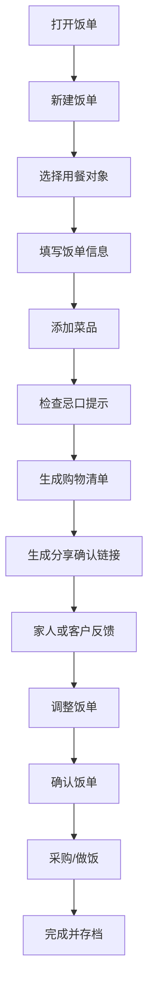

# 饭单 MVP 第一版方案

## 1. 产品概述

### 产品名

饭单

### 一句话定位

给家人和客户安排菜单、确认忌口、生成购物清单。

### 产品本质

饭单不是菜谱社区，也不是单纯的家庭备忘录，而是一个围绕“吃什么”展开的菜单协作工具。

它解决的是多角色之间的用餐交付问题：

- 谁来安排菜单
- 谁要吃
- 谁有忌口
- 谁来确认
- 谁去采购
- 哪些菜和菜单可以下次复用

### 第一版战略

第一版先做一个通用底座：

> 新建饭单 -> 添加菜品 -> 分享确认 -> 生成购物清单 -> 存档复用

这个底座同时适配家庭和服务者，但冷启动验证时优先面向服务者。

## 2. 目标用户

### 第一目标用户

上门做饭、私厨、做饭阿姨。

这类用户现在常用微信、小红书私信、备忘录或表格与客户沟通菜单。常见问题是：

- 客户忌口和口味散落在聊天记录里
- 每次都要重复问人数、预算、吃辣程度
- 菜单确认不清楚，临时改菜麻烦
- 采购清单需要手动整理
- 做过的菜单和客户偏好没有沉淀

饭单第一版要让这类用户更快、更专业地完成菜单交付。

### 兼容用户

普通家庭。

家庭用户用饭单做每周菜单、购物清单、家庭忌口和历史菜单复用。家庭用户的付费意愿可能较弱，但使用频率高，适合作为产品基础盘。

### 传播场景

家宴、朋友聚餐。

一个人创建饭单，发给参与者确认菜品和忌口，再生成购物清单。这个场景频率不一定高，但分享属性强，适合作为自然传播入口。

### 后续扩展用户

- 月嫂、育儿嫂、月子餐服务
- 老人照护、居家养老餐
- 健身教练、营养师
- 儿童小饭桌、托管餐
- 减脂餐、备餐服务小团队

这些场景都可以基于同一套“饭单 + 人群偏好 + 购物清单 + 分享确认”底座扩展，但第一版不做深度专业规则。

## 3. 核心场景

### 场景 A：私厨给客户出家宴菜单

1. 私厨创建客户“张女士家”
2. 记录 6 人、少辣、孩子不吃香菜、预算 600 元
3. 创建“周六晚餐家宴”饭单
4. 添加菜品：清蒸鲈鱼、红烧肉、番茄炒蛋、青菜、汤
5. 系统生成购物清单
6. 私厨把确认链接发给客户
7. 客户标记不喜欢或补充忌口
8. 私厨调整菜单并锁定
9. 服务完成后存档，下次可复用

### 场景 B：做饭阿姨给雇主确认明日菜单

1. 阿姨创建“李先生家”
2. 记录老人低盐、孩子不吃辣
3. 创建“明日晚餐”饭单
4. 从历史菜品快速添加 3 菜 1 汤
5. 发给雇主确认
6. 雇主点选“换一道青菜”
7. 阿姨调整后生成采购清单

### 场景 C：家庭安排一周晚餐

1. 用户创建“我家”
2. 录入家庭成员和忌口
3. 创建“本周晚餐”饭单
4. 按周一到周日添加菜品
5. 家人查看并反馈
6. 系统汇总本周购物清单
7. 买菜时勾选已购买
8. 饭单进入历史，下周复用

### 场景 D：朋友聚餐收集忌口

1. 组织者创建“周末聚餐”
2. 选择日期、人数、地点
3. 添加候选菜品
4. 发链接给朋友
5. 朋友选择喜欢/不喜欢并填写忌口
6. 组织者根据反馈调整菜单
7. 系统生成最终购物清单

## 4. MVP 功能边界

### 第一版必须做

#### 1. 用餐对象

用餐对象是饭单的归属，可以是家庭、客户、聚餐、机构班级等。

字段：

- 名称
- 类型：我家、客户、聚餐、其他
- 人数
- 口味偏好
- 忌口/过敏
- 预算备注
- 联系备注

#### 2. 菜品库

第一版不要求用户先维护完整菜品库，而是允许在创建饭单时顺手添加菜品。

字段：

- 菜名
- 分类：荤菜、素菜、汤、主食、甜品、饮品、其他
- 食材
- 简单做法
- 标签：快手菜、适合儿童、少油、少盐、下饭、聚餐等
- 可见范围：自己可见、对象内可见

#### 3. 饭单

饭单是核心实体。

支持类型：

- 单餐饭单
- 一日饭单
- 一周饭单
- 聚餐饭单

字段：

- 标题
- 用餐对象
- 日期或日期范围
- 餐别：早餐、午餐、晚餐、加餐、聚餐
- 菜品列表
- 状态：草稿、待确认、已确认、已完成、已归档

#### 4. 购物清单

根据饭单菜品中的食材生成初始清单，支持手动调整。

第一版不做复杂单位换算，只做可编辑汇总。

功能：

- 自动汇总食材名称
- 支持手动添加、删除、修改
- 支持勾选已购买
- 支持按分类显示：蔬菜、肉蛋、水产、主食、调味品、其他

#### 5. 分享确认链接

服务者或家庭组织者可以生成饭单分享链接。

访客无需注册，可完成：

- 查看饭单
- 对菜品标记喜欢、不喜欢、想替换
- 填写忌口或备注
- 点击确认饭单

#### 6. 历史复用

完成后的饭单可以归档，后续复制为新饭单。

第一版重点支持：

- 复制历史饭单
- 从历史饭单导入菜品
- 查看某个对象过去吃过什么

### 第一版暂不做

- 菜谱社区
- AI 自动推荐
- 精确营养计算
- PDF/图片导出
- 实时多人协作
- 完整库存管理
- 自动单位换算
- 支付和订单
- 上门服务交易撮合
- 小饭桌合规留样系统
- 医疗级营养建议

## 5. 信息架构

### 主导航

1. 首页
2. 饭单
3. 菜品
4. 对象
5. 购物清单
6. 设置

### 首页

目标是让用户快速继续工作。

内容：

- 今日/本周饭单
- 待确认饭单
- 最近对象
- 最近使用菜品
- 新建饭单按钮

### 饭单页

功能：

- 饭单列表
- 状态筛选
- 类型筛选
- 新建饭单
- 复制饭单
- 进入饭单详情

### 饭单详情页

第一版最核心页面。

区域：

- 基本信息：标题、对象、日期、状态
- 菜品区域：按餐别或日期分组
- 忌口提示：展示对象偏好与潜在冲突
- 购物清单入口
- 分享确认按钮
- 存档/复制按钮

### 菜品页

功能：

- 菜品列表
- 搜索
- 分类筛选
- 添加/编辑菜品
- 从菜品添加到饭单

### 对象页

功能：

- 对象列表
- 添加家庭/客户/聚餐对象
- 编辑人数、口味、忌口、预算备注
- 查看对象历史饭单

### 购物清单页

功能：

- 查看某个饭单对应的购物清单
- 勾选已购买
- 手动调整
- 按分类查看

### 分享确认页

访客页面，不需要登录。

内容：

- 饭单标题
- 用餐时间
- 菜品列表
- 喜欢/不喜欢/想替换
- 忌口备注
- 确认按钮

## 6. 核心用户流程

### 主流程

### 第一次使用流程

第一版应该降低首次使用门槛。

推荐流程：

1. 打开产品
2. 点击“新建饭单”
3. 输入饭单标题
4. 选择用途：我家日常、客户家庭、朋友聚餐、其他
5. 填写对象名称和人数
6. 添加菜品
7. 生成购物清单或分享链接

不要强迫用户先注册完整资料、建完整菜品库、录完整家庭成员。

## 7. 数据模型草案

### users

- id
- email
- phone
- name
- avatar_url
- created_at
- updated_at

### spaces

工作空间。家庭用户可以有“我家”，服务者可以有“我的客户”。

- id
- owner_user_id
- name
- type：personal、family、provider
- created_at
- updated_at

### meal_targets

用餐对象。

- id
- space_id
- name
- type：home、client、gathering、other
- people_count
- taste_notes
- allergy_notes
- budget_notes
- contact_notes
- created_at
- updated_at

### dishes

- id
- space_id
- name
- category
- description
- recipe_steps
- tags
- visibility：private、space
- created_by
- created_at
- updated_at

### dish_ingredients

- id
- dish_id
- name
- amount
- unit
- category
- notes

### meal_plans

- id
- space_id
- target_id
- title
- type：single_meal、day、week、gathering
- status：draft、reviewing、confirmed、completed、archived
- start_date
- end_date
- notes
- created_by
- created_at
- updated_at

### meal_plan_items

- id
- meal_plan_id
- dish_id
- date
- meal_slot：breakfast、lunch、dinner、snack、gathering
- sort_order
- notes

### shopping_lists

- id
- meal_plan_id
- title
- status：active、completed、archived
- created_at
- updated_at

### shopping_list_items

- id
- shopping_list_id
- name
- amount
- unit
- category
- checked
- source_dish_id
- notes

### share_links

- id
- meal_plan_id
- token
- permission：view、feedback、confirm
- expires_at
- created_at

### feedback

- id
- meal_plan_id
- share_link_id
- dish_id
- visitor_name
- type：like、dislike、replace、note、confirm
- content
- created_at

## 8. API 草案

### Auth

- POST /auth/login
- POST /auth/logout
- GET /me

第一版可以先支持邮箱验证码或 magic link。

### Objects

- GET /targets
- POST /targets
- GET /targets/:id
- PATCH /targets/:id
- DELETE /targets/:id
- GET /targets/:id/meal-plans

### Dishes

- GET /dishes
- POST /dishes
- GET /dishes/:id
- PATCH /dishes/:id
- DELETE /dishes/:id

### Meal Plans

- GET /meal-plans
- POST /meal-plans
- GET /meal-plans/:id
- PATCH /meal-plans/:id
- DELETE /meal-plans/:id
- POST /meal-plans/:id/items
- PATCH /meal-plans/:id/items/:itemId
- DELETE /meal-plans/:id/items/:itemId
- POST /meal-plans/:id/duplicate
- POST /meal-plans/:id/archive

### Shopping Lists

- POST /meal-plans/:id/shopping-list/generate
- GET /shopping-lists/:id
- PATCH /shopping-lists/:id/items/:itemId
- POST /shopping-lists/:id/items
- DELETE /shopping-lists/:id/items/:itemId

### Share

- POST /meal-plans/:id/share-links
- GET /share/:token
- POST /share/:token/feedback
- POST /share/:token/confirm

## 9. 技术栈建议

### 推荐栈

- 应用框架：SvelteKit + Svelte 5
- 样式：Tailwind CSS
- 组件：shadcn-svelte
- 认证与权限：Better Auth
- 表单：Superforms + Zod 或 Valibot
- 状态管理：Svelte 5 runes + SvelteKit load/actions，必要时引入 TanStack Svelte Query
- 后端：SvelteKit server routes/actions 优先
- 运行环境：Cloudflare Workers / Pages
- 数据库：Cloudflare D1
- ORM：Drizzle
- 文件存储：后续可用 Cloudflare R2
- API：RESTful API

### Hono 的定位

第一版不默认拆出独立 Hono API。饭单 MVP 主要是表单、列表、详情、分享页、CRUD 和轻量清单生成，SvelteKit 的 server routes、load 和 form actions 已经足够，能减少前后端胶水代码。

Hono 后续可用于：

- 开放给小程序、移动端或第三方的独立 API
- 独立 worker 服务
- 批处理、导出、推荐等边界更清晰的后端模块

### 为什么先不用 Go

第一版主要是 CRUD、分享链接、清单生成和轻量协作。SvelteKit + Cloudflare + D1 更快、更低成本，也更适合快速验证。

Go 可以后续用于：

- 大批量导出
- 复杂推荐
- 营养计算服务
- 独立任务队列

## 10. 商业化假设

### 免费版

适合家庭和试用服务者。

限制：

- 最多 3 个用餐对象
- 最多 20 道菜品
- 最多 10 个历史饭单
- 基础购物清单
- 基础分享链接

### 专业版

面向做饭阿姨、私厨、轻量餐饮服务者。

价格假设：

- 19-39 元/月
- 128-298 元/年

能力：

- 不限客户对象
- 不限菜品
- 历史饭单复用
- 客户确认链接
- 品牌分享页
- 常用菜单模板
- 高级购物清单

### 团队版

面向私厨团队、小饭桌、月子餐服务、老人餐服务。

价格假设：

- 99-299 元/月

能力：

- 多成员
- 多客户/班级
- 权限管理
- 批量菜单
- 采购记录
- 报表导出

## 11. 第一版开发里程碑

### Milestone 1：产品骨架

- 项目初始化
- 登录基础
- 主导航
- 首页
- 数据库 schema

### Milestone 2：对象和菜品

- 用餐对象 CRUD
- 菜品 CRUD
- 食材录入
- 标签和分类

### Milestone 3：饭单核心

- 新建饭单
- 添加菜品
- 按餐别/日期展示
- 饭单状态流转
- 复制历史饭单

### Milestone 4：购物清单

- 根据饭单生成购物清单
- 手动调整
- 勾选已购买
- 分类展示

### Milestone 5：分享确认

- 生成分享链接
- 访客查看饭单
- 访客反馈
- 访客确认
- 创建者查看反馈并调整

### Milestone 6：MVP 打磨

- 移动端适配
- 空状态和引导
- 常用模板
- 基础权限
- 部署上线

## 12. 验证计划

### 第一批验证对象

- 3-5 位做饭阿姨/上门做饭服务者
- 2-3 位经常组织家庭聚餐的人
- 3-5 个普通家庭

### 关键问题

- 他们是否愿意用饭单代替微信文字菜单
- 创建一份饭单是否足够快
- 分享确认链接是否减少沟通成本
- 购物清单是否真的有用
- 历史复用是否带来明显效率提升
- 服务者是否愿意为专业版付费

### 核心指标

- 首次创建饭单完成率
- 饭单分享率
- 访客反馈率
- 购物清单使用率
- 7 日内再次创建饭单比例
- 服务者试用后付费意愿

## 13. 后续路线图

### V1.1：模板能力

- 家宴模板
- 一周家常菜模板
- 儿童餐模板
- 老人餐模板
- 月子餐模板

### V1.2：客户管理增强

- 客户历史偏好
- 客户服务记录
- 常用预算
- 菜品满意度

### V1.3：库存和冰箱食材

- 家庭库存
- 低库存提醒
- 即将过期提醒
- 根据已有食材筛选菜品

### V1.4：营养与健康

- 热量和营养字段
- 简单营养目标
- 低盐、低糖、高蛋白标签
- 非医疗级提示

### V1.5：专业服务版本

- 品牌分享页
- PDF/图片导出
- 报价备注
- 客户确认记录
- 团队协作

### V2：垂直场景扩展

- 月子餐方案
- 老人餐方案
- 健身餐方案
- 儿童小饭桌菜单公示
- 采购和留样记录

## 14. 当前决策

### 已确定

- 产品名暂定：饭单
- 定位：给家人和客户安排菜单、确认忌口、生成购物清单
- 第一目标用户：上门做饭、私厨、做饭阿姨
- 兼容用户：普通家庭、家宴聚餐
- 第一版核心闭环：新建饭单 -> 添加菜品 -> 分享确认 -> 生成购物清单 -> 存档复用
- 技术栈：SvelteKit + Svelte 5 + Tailwind CSS + shadcn-svelte + Better Auth + Superforms + Cloudflare Workers/Pages + D1 + Drizzle

### 待确认

- 第一版是否必须支持图片上传
- 分享页是否允许访客查看购物清单
- 是否在第一版加入价格/预算字段
- 专业版付费边界放在哪些功能上

## 15. 调研依据摘要

- 上门做饭服务正在社交平台兴起，服务前需要沟通口味、忌口和食材准备。参考：新华网转载报道 https://www.stdaily.com/web/gdxw/2025-05/20/content_342292.html
- 国外营养师和教练 meal planning 工具已经验证了“客户方案 + 菜单 + 购物清单”的专业付费场景。参考：NutriAdmin https://nutriadmin.com/features/meal-planning-software
- 居家养老助餐、儿童托管餐等场景长期存在菜单公示、忌口、合规记录需求，但第一版不宜做深监管功能。
