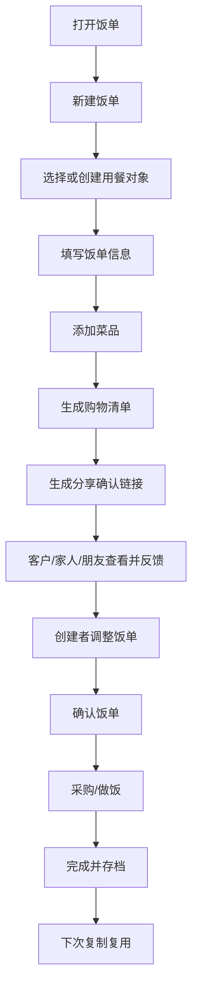

# 饭单 项目总方案

## 1. 项目结论

饭单是一个面向家庭和家庭餐饮服务者的菜单协作工具。

它不做菜谱社区，也不做餐饮交易撮合。第一阶段重点解决：

> 谁来安排菜单、谁要吃、谁有忌口、谁来确认、谁去采购、哪些菜单可以下次复用。

第一版产品要跑通一个清晰闭环：

> 新建饭单 -> 添加菜品 -> 分享确认 -> 生成购物清单 -> 存档复用

## 2. 产品名与定位

### 产品名

饭单

### 一句话定位

给家人和客户安排菜单、确认忌口、生成购物清单。

### 更完整的定位

饭单帮助家庭成员、做饭阿姨、私厨、聚餐组织者等“负责安排吃什么的人”，快速创建菜单方案，发给家人或客户确认，并自动整理可编辑的购物清单。

### 产品关键词

- 菜单协作
- 用餐计划
- 忌口确认
- 购物清单
- 菜品复用
- 家庭与客户交付

## 3. 项目背景

原始需求是一款家庭菜单 Web App，覆盖用户管理、家庭组、菜单、菜品、购物清单、食材库存、健康追踪、聚餐支持、数据统计等完整愿景。

经过讨论后，项目方向从“家庭自用菜单工具”扩展为“家庭 + 服务者都能用的菜单协作工具”。

核心判断：

- 普通家庭有高频使用需求，但付费意愿可能偏弱。
- 做饭阿姨、私厨、上门做饭服务者有明确菜单交付痛点，付费意愿更强。
- 聚餐场景频率较低，但天然适合分享和传播。
- 月子餐、老人餐、健身餐、小饭桌等场景有价值，但第一版不宜做深度专业规则。

## 4. 目标用户排序

### 第一目标用户

上门做饭、私厨、做饭阿姨。

他们当前常见工作方式是微信、小红书私信、备忘录或表格。痛点包括：

- 客户口味、忌口、预算散落在聊天记录里
- 每次服务前都要重复沟通
- 菜单确认不清楚
- 临时换菜容易混乱
- 采购清单需要手动整理
- 历史菜单和客户偏好没有沉淀

### 兼容用户

普通家庭。

他们用饭单安排一周菜单、记录家庭忌口、生成购物清单、复用历史饭单。

### 传播场景

家宴、朋友聚餐。

组织者创建饭单，发给参与者收集忌口和菜品反馈，再生成采购清单。

### 后续扩展用户

- 月嫂、育儿嫂、月子餐服务
- 老人照护、居家养老餐
- 健身教练、营养师
- 儿童小饭桌、托管餐
- 减脂餐、备餐服务小团队

## 5. 核心用户角色

### 创建者

登录后使用饭单的人，可以是家庭成员、做饭阿姨、私厨、聚餐组织者。

能力：

- 创建和管理用餐对象
- 创建和编辑菜品
- 创建和编辑饭单
- 生成购物清单
- 生成分享确认链接
- 查看访客反馈
- 归档和复用饭单

### 访客

通过分享链接打开饭单的人，可以是客户、家人、朋友、雇主。

能力：

- 查看饭单
- 对菜品反馈
- 提交忌口备注
- 确认饭单

第一版访客不需要注册。

## 6. 第一版 MVP 范围

### 必须做

#### 用餐对象

用餐对象是饭单归属，可以是家庭、客户、聚餐、其他场景。

字段：

- 名称
- 类型：我家、客户、聚餐、其他
- 人数
- 口味偏好
- 忌口/过敏
- 预算备注
- 联系备注

#### 菜品库

第一版不要求用户先维护完整菜品库。用户可以在创建饭单时顺手创建菜品。

字段：

- 菜名
- 分类
- 食材
- 简单做法
- 标签
- 可见范围

#### 饭单

饭单是核心实体。

支持类型：

- 单餐饭单
- 一日饭单
- 一周饭单
- 聚餐饭单

状态：

- 草稿
- 待确认
- 已确认
- 已完成
- 已归档

#### 购物清单

根据饭单菜品中的食材生成初始清单，支持手动调整。

第一版不做复杂单位换算，只做可编辑汇总。

#### 分享确认链接

创建者可以生成分享链接。访客无需注册即可查看饭单、反馈菜品、填写忌口和确认。

#### 历史复用

完成后的饭单可以归档，后续复制为新饭单。

### 第一版不做

- 菜谱社区
- AI 自动推荐
- 精确营养计算
- PDF/图片导出
- 实时多人协作
- 完整库存管理
- 自动单位换算
- 支付和订单
- 上门服务交易撮合
- 小饭桌合规留样系统
- 医疗级营养建议
- 菜品图片上传

## 7. 核心流程

## 8. 页面结构

第一版页面：

1. 登录页
2. 首页
3. 饭单列表页
4. 新建/编辑饭单页
5. 饭单详情页
6. 菜品列表页
7. 新建/编辑菜品页
8. 用餐对象列表页
9. 新建/编辑用餐对象页
10. 购物清单页
11. 分享确认页
12. 设置页

核心页面是饭单详情页，用户应能在这里完成添加菜品、生成购物清单、分享确认、查看反馈、确认和归档。

## 9. 数据模型

核心表：

- users
- spaces
- meal_targets
- dishes
- dish_ingredients
- meal_plans
- meal_plan_items
- shopping_lists
- shopping_list_items
- share_links
- feedback

设计原则：

- 所有创建者数据按 space 隔离。
- meal_targets 表示家庭、客户、聚餐等用餐对象。
- meal_plans 是核心实体。
- dishes 可以从饭单创建过程中沉淀。
- shopping_lists 从 meal_plans 生成，但允许用户手动修改。
- share_links 支持访客免登录访问。
- feedback 记录访客对菜品和饭单的反馈。

## 10. 技术路线

推荐技术栈：

- 应用框架：SvelteKit + Svelte 5
- 样式：Tailwind CSS
- 组件：shadcn-svelte
- 认证与权限：Better Auth
- 表单：Superforms + Zod 或 Valibot
- 状态管理：Svelte 5 runes + SvelteKit load/actions，必要时引入 TanStack Svelte Query
- 后端：SvelteKit server routes/actions 优先
- 运行环境：Cloudflare Workers / Pages
- 数据库：Cloudflare D1
- ORM：Drizzle
- 文件存储：后续使用 Cloudflare R2
- API：RESTful API

第一版不默认拆出独立 Hono API。当前产品主要是表单、列表、详情、分享页、CRUD、清单生成和轻量协作，SvelteKit 全栈能减少胶水代码，更适合快速验证。

Hono 后续可用于开放 API、小程序接口、移动端接口、独立 worker 服务、批处理、导出或推荐等边界更清晰的后端模块。

第一版暂不使用 Go。Go 可以后续用于大批量导出、复杂推荐、营养计算服务或独立任务队列。

## 11. 开发阶段

### Phase 0 项目初始化

搭建 SvelteKit、Svelte 5、Tailwind、shadcn-svelte、Better Auth、Superforms、D1、Drizzle、基础路由和验证命令。

### Phase 1 数据模型与基础 API

建立核心数据表、关系、REST API 基础设施和统一错误返回。

### Phase 2 登录和工作空间

实现邮箱登录或 magic link、默认 space、登录态、未登录拦截和数据隔离。

### Phase 3 用餐对象

支持家庭、客户、聚餐等对象的创建、编辑、搜索、筛选，并可从对象直接创建饭单。

### Phase 4 菜品库

支持菜品、食材、分类、标签的录入和复用。第一版允许只填菜名保存。

### Phase 5 饭单核心

实现饭单列表、新建、详情、添加菜品、快速创建菜品、状态流转、复制和归档。

### Phase 6 购物清单

根据饭单食材生成可编辑购物清单，支持分类、手动调整、勾选已购买和重新生成。

### Phase 7 分享确认

支持生成分享链接，访客无需登录即可查看饭单、反馈菜品、填写忌口和确认。

### Phase 8 MVP 打磨与上线

完成首页、空状态、移动端适配、部署、错误处理、测试数据和真实用户试用准备。

## 12. Linear 项目

Linear 已创建项目：

- 项目名：饭单 MVP
- Team：Less
- 项目负责人：MarXII
- 状态：Planned
- 优先级：High
- 项目链接：https://linear.app/less-lab/project/饭单-mvp-d897ee8f2701
- 开发计划文档：https://linear.app/less-lab/document/饭单-mvp-开发计划-757a741f9249

已创建 9 个里程碑：

- Phase 0 项目初始化
- Phase 1 数据模型与基础 API
- Phase 2 登录和工作空间
- Phase 3 用餐对象
- Phase 4 菜品库
- Phase 5 饭单核心
- Phase 6 购物清单
- Phase 7 分享确认
- Phase 8 MVP 打磨与上线

已创建 20 个开发 issue：

- LES-80 初始化饭单项目骨架
- LES-81 配置 Cloudflare D1 与 Drizzle 本地开发
- LES-82 建立 MVP 核心数据模型
- LES-83 实现统一 API 基础设施
- LES-84 实现邮箱登录和默认工作空间
- LES-85 实现用餐对象 CRUD API
- LES-86 实现用餐对象列表和编辑页面
- LES-87 实现菜品与食材 CRUD API
- LES-88 实现菜品列表和编辑页面
- LES-89 实现饭单 CRUD API 和状态流转
- LES-90 实现饭单列表和新建流程
- LES-91 实现饭单详情工作台
- LES-92 实现购物清单生成 API
- LES-93 实现购物清单页面
- LES-94 实现分享链接和访客反馈 API
- LES-95 实现访客分享确认页
- LES-96 在饭单详情中展示反馈聚合
- LES-97 实现首页和新用户空状态引导
- LES-98 完成移动端体验、错误状态和基础打磨
- LES-99 部署 MVP 并准备真实用户验证

## 13. 本地文档资产

当前已形成四份项目文档：

- 饭单-MVP第一版方案.md
- 饭单-页面级PRD.md
- 饭单-MVP开发任务清单.md
- 饭单-项目总方案.md

这些文件位于：

`/Users/meat/Documents/Codex/2026-06-10/files-mentioned-by-the-user-web/outputs`

## 14. 验证计划

第一批验证对象：

- 3-5 位做饭阿姨或上门做饭服务者
- 2-3 位经常组织家庭聚餐的人
- 3-5 个普通家庭

关键问题：

- 是否愿意用饭单代替微信文字菜单
- 创建一份饭单是否足够快
- 分享确认链接是否减少沟通成本
- 购物清单是否真的有用
- 历史复用是否带来效率提升
- 服务者是否愿意为专业版付费

核心指标：

- 首次创建饭单完成率
- 饭单分享率
- 访客反馈率
- 购物清单使用率
- 7 日内再次创建饭单比例
- 服务者试用后付费意愿

## 15. 商业化假设

### 免费版

适合家庭和试用服务者。

可能限制：

- 最多 3 个用餐对象
- 最多 20 道菜品
- 最多 10 个历史饭单
- 基础购物清单
- 基础分享链接

### 专业版

面向做饭阿姨、私厨、轻量餐饮服务者。

价格假设：

- 19-39 元/月
- 128-298 元/年

能力：

- 不限客户对象
- 不限菜品
- 历史饭单复用
- 客户确认链接
- 品牌分享页
- 常用菜单模板
- 高级购物清单

### 团队版

面向私厨团队、小饭桌、月子餐服务、老人餐服务。

价格假设：

- 99-299 元/月

能力：

- 多成员
- 多客户/班级
- 权限管理
- 批量菜单
- 采购记录
- 报表导出

## 16. 后续路线

### V1.1 家庭工作区与协作

- 工作区成员关系
- 邀请链接与加入流程
- 所有者和成员权限
- 多工作区创建与切换
- 成员操作归属
- 家庭共同采购
- 多人修改冲突保护

详细执行计划见《饭单-1.1家庭协作开发计划.md》和 Linear 项目“饭单 1.1 家庭协作”。

### V1.2 模板能力

- 家宴模板
- 一周家常菜模板
- 儿童餐模板
- 老人餐模板
- 月子餐模板

### V1.3 客户管理增强

- 客户历史偏好
- 客户服务记录
- 常用预算
- 菜品满意度

### V1.4 库存和冰箱食材

- 家庭库存
- 低库存提醒
- 即将过期提醒
- 根据已有食材筛选菜品

### V1.5 营养与健康

- 热量和营养字段
- 简单营养目标
- 低盐、低糖、高蛋白标签
- 非医疗级提示

### V1.6 专业服务版本

- 品牌分享页
- PDF/图片导出
- 报价备注
- 客户确认记录
- 团队协作

### V2 垂直场景扩展

- 月子餐方案
- 老人餐方案
- 健身餐方案
- 儿童小饭桌菜单公示
- 采购和留样记录

## 17. 新项目接力说明

如果后续在新的 Codex 项目或新对话中继续“饭单”，建议先提供或引用以下上下文：

1. 产品名：饭单
2. 定位：给家人和客户安排菜单、确认忌口、生成购物清单
3. 第一目标用户：上门做饭、私厨、做饭阿姨
4. 第一版核心闭环：新建饭单 -> 添加菜品 -> 分享确认 -> 生成购物清单 -> 存档复用
5. 技术栈：SvelteKit + Svelte 5 + Tailwind + shadcn-svelte + Better Auth + Superforms + Cloudflare Workers/Pages + D1 + Drizzle
6. Linear 项目：饭单 MVP
7. 开发从 Linear issue LES-80 开始

建议新项目第一步：

> 根据饭单项目总方案和 Linear issue LES-80，初始化项目骨架。

## 18. 当前最终决策

- 产品名暂定为“饭单”
- 第一版不是菜谱社区，而是菜单协作工具
- 产品同时兼容家庭和服务者，但冷启动优先服务者
- 用户入口统一为“新建饭单”，不强迫先选择复杂身份
- 访客分享页无需登录
- 第一版购物清单定位为“可编辑初稿”，不追求复杂单位换算
- 第一版不做 AI、营养、库存、支付、交易撮合
- 先做 Web App，不做小程序和原生 App
- 后端优先 SvelteKit server routes/actions，不默认拆出独立 Hono API
- Hono 后续用于开放 API、小程序接口、移动端接口或独立 worker 服务
- 状态管理优先 Svelte 5 runes + SvelteKit load/actions，必要时引入 TanStack Svelte Query
- 认证与权限使用 Better Auth
- 表单使用 Superforms + Zod 或 Valibot
- 第一版不引入 Go
